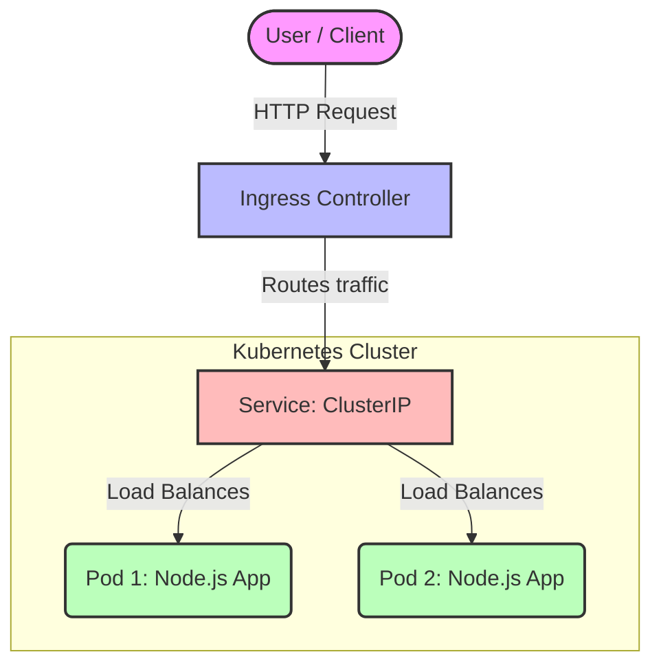

<div align="center">
  <h1>🚀 Hello Service</h1>
  <p>A tiny, lightweight Node.js demo service, containerized with Docker, and deployed via Helm charts. Live on GitHub Pages!</p>
</div>

---

## 🌟 Overview

**Hello Service** is a simple backend service built with Node.js and Express. It responds with a customizable greeting message and the host machine's name. I created this project to demonstrate end-to-end service delivery:
1. **Building a Microservice:** Wrote a tiny Node.js API.
2. **Containerization:** Packaged the app into a Docker image (`shellcorex/hello-service:1.0.0`).
3. **Kubernetes Deployment:** Created a custom Helm chart for it.
4. **GitOps / Hosting:** Packaged the chart and hosted it live on **GitHub Pages** as a Helm repository!

## 🏗️ Architecture & Flow

Here is a high-level architecture diagram of how the traffic flows through Kubernetes to reach the service:



---

## ✨ Features

- **JSON Response:** Returns a customizable greeting and the server's hostname.
- **Health Checks:** Includes a built-in `/healthz` endpoint for Kubernetes liveness/readiness probes.
- **Environment Driven:** Reads the greeting message directly from the `GREETING` environment variable.
- **Helm Managed:** Easily configurable values for replicas, resource limits, Docker image tags, and Ingress settings.

## 📦 How to Use the Helm Chart

Since the Helm chart is hosted on GitHub Pages, you can add it to your cluster with just a few commands!

### 1. Add the Helm Repository

```bash
helm repo add opsbyabdullah https://opsbyabdullah.github.io/helm-chart/
helm repo update
```

### 2. Install the Chart

```bash
helm install my-hello-service opsbyabdullah/hello-service
```

### 3. Customize Values (Optional)
You can override default values like the greeting message, replica count, or target port during installation:

```bash
helm install my-hello-service opsbyabdullah/hello-service --set greeting="Hello from GitHub!" --set replicaCount=3
```

---

## 💻 Service Endpoints

Once deployed, you can interact with the following endpoints:

| Endpoint | Method | Description |
|---|---|---|
| `/` | `GET` | Returns a JSON response with the greeting and hostname. |
| `/healthz` | `GET` | Healthcheck endpoint. Returns `ok` with status `200`. |

**Example Response from `/`**:
```json
{
  "message": "Hello from KubeCore!",
  "hostname": "hello-service-deployment-5c74797d95-8k2jx"
}
```

---

## 🛠️ Project Structure

```text
hello-service/
├── app/                  # Node.js source code
│   ├── server.js         # Main Express application
│   ├── package.json      # Dependencies
│   └── Dockerfile        # Container build instructions
├── templates/            # Kubernetes manifest templates for Helm
├── Chart.yaml            # Helm Chart metadata
└── values.yaml           # Default configuration values for Helm
```

---
*Created with ❤️ by Abdullah*
